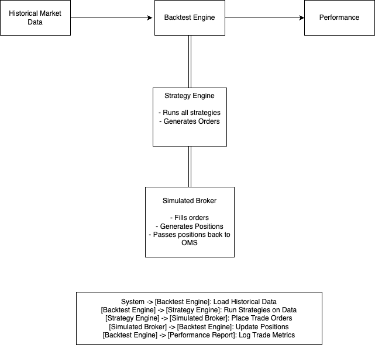

# C++ Algorithmic Trading System

A modern C++ framework for algorithmic trading, backtesting strategies, and live trading.

## **Building the Project**

### Prerequisites
- CMake 3.3 or higher
- C++23 compatible compiler
- nlohmann_json library (automatically fetched)
- GoogleTest (automatically fetched)

### To Build
```sh
# Create a build directory
mkdir -p build
cd build

# Configure the project
cmake ..

# Build
make -j4
```

### To Run
```sh
# Run from the project root directory
./build_run.sh
```
This script builds and runs the trading system.

### To Run Backtester
```sh
# Run from the project root directory
./build_run_backtest.sh
```

### Running Tests
```sh
# From the build directory
ctest
# or
make test
```
Individual test executables are located in subdirectories:
```
./build/tests/data_access_tests/data_access_tests
./build/tests/oms_tests/oms_tests
./build/tests/strategy_tests/strategy_tests
./build/tests/broker_tests/broker_tests
./build/tests/backtest_tests/backtest_tests
./build/tests/util_tests/util_tests
```

### To Debug Crash
```sh
lldb ./build/app/algo_trader_app
run
bt
```

## **Architecture**  

### **System Overview**  
<details>
  <summary>View Diagram</summary>

    

</details>  

The **System Overview** provides a high-level architecture of the trading platform. It includes:  
- **Data Fetching** (Python script fetching market data)  
- **Data Storage** (CSV files for historical data)  
- **C++ Backend** (Processes data, runs strategies, and manages orders)  
- **Broker API Integration** (Executes trades)  

---

### **Data Reader**  
<details>
  <summary>View Diagram</summary>

    

</details>  

The **Data Reader** is responsible for:  
- Reading market data from CSV files  
- Parsing and structuring the data for the trading system  
- Feeding the data into the **Strategy Engine** for signal generation  

---

### **Data Flow**  
<details>
  <summary>View Diagram</summary>

    

</details>  

The **Data Flow** diagram illustrates how data moves through the system:  
1. **Python fetches market data** and saves it to a CSV file  
2. **C++ reads the CSV** and processes market conditions  
3. **Strategies analyze the data** and generate trading signals  
4. **Orders are sent to the OMS**, which manages execution via the broker  

---

### **Order Management System (OMS)**  
<details>
  <summary>View Diagram</summary>

    

</details>  

The **Order Management System (OMS)** handles:  
- Storing open **orders** (buy/sell requests)  
- Tracking **positions** (executed orders)  
- Communicating with the broker API for order execution  
- Managing order status updates (e.g., filled, canceled)  

---

### **Strategy Engine**  
<details>
  <summary>View Diagram</summary>

    

</details>  

The **Strategy Engine** is the core of trade decision-making:  
- Receives **market data** and analyzes trading conditions  
- Runs **trading strategies** (e.g., Moving Average Crossover, RSI)  
- Generates **trade signals** (buy/sell orders)  
- Sends orders to the OMS for execution  

---

### **Backtest Engine**  
<details>
  <summary>View Diagram</summary>

    

</details>  

The **Backtest Engine** allows testing strategies on historical data:  
- **Simulates market conditions** by feeding past data to strategies  
- **Executes trades** as if they were placed in real-time  
- **Evaluates strategy performance** using metrics like win/loss ratio, Sharpe ratio, and drawdown  
- Helps refine trading algorithms before live deployment